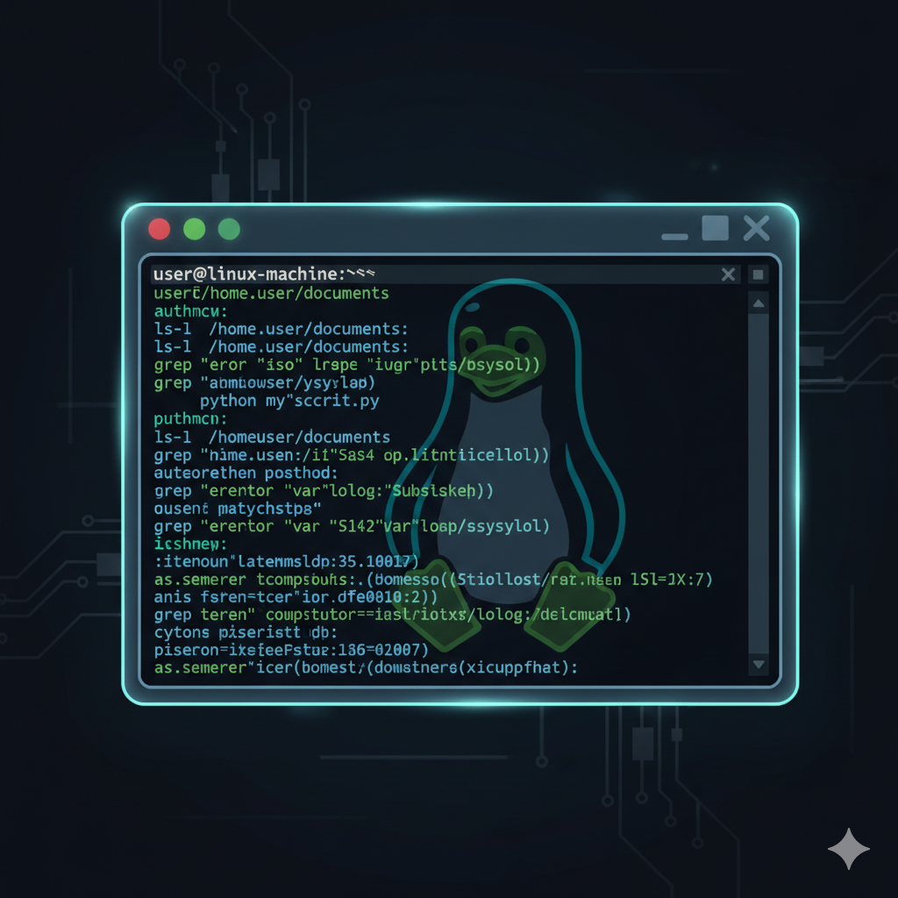
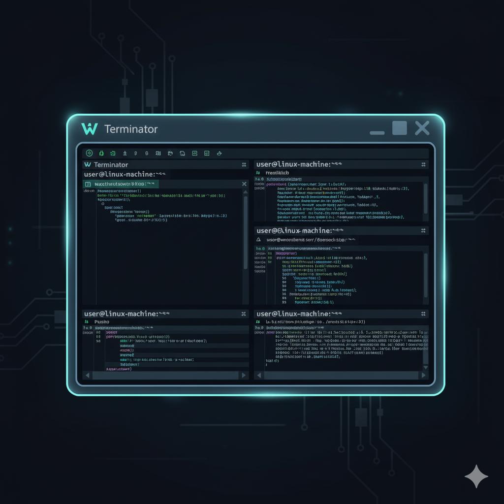
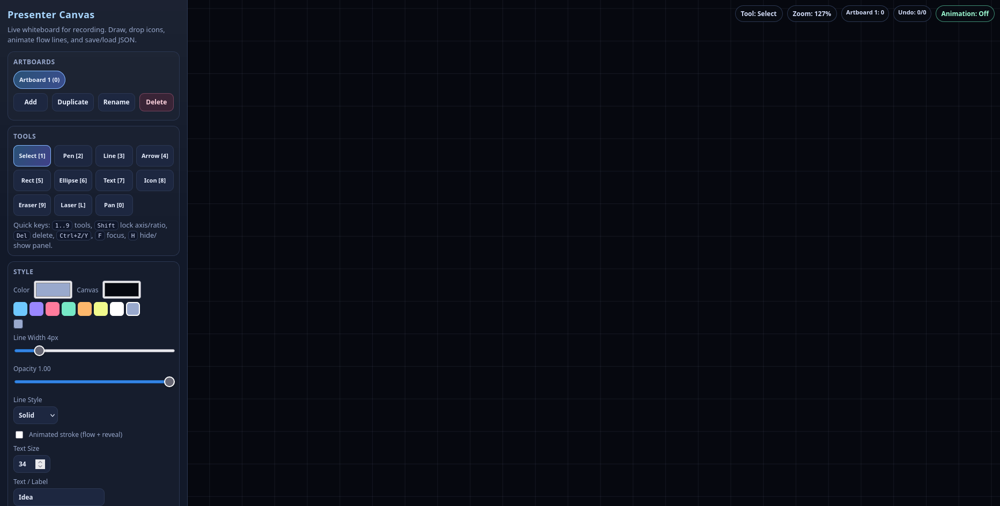

# Linux Utilities



This directory contains a collection of utility scripts designed to enhance my workflow on Linux, particularly with AwesomeWM and various AI CLI tools. The primary objective is to streamline daily tasks, automate repetitive actions, and facilitate a more efficient and seamless integration of these technologies.

## My Setup



My current setup is simple and focused on efficiency:

*   **OS:** Linux Mint
*   **Window Manager:** awesomeWM
*   **Terminal:** Terminator
*   **Tooling:** AI CLI tools

## AwesomeWM rc.lua Make Targets

Use these shortcuts to back up and deploy the AwesomeWM config:

```bash
# Copy the active Awesome rc.lua into local rc.dupe.lua
make rc-backup

# Backup current system rc.lua (timestamped) + install local rc.lua into /etc/xdg/awesome/rc.lua
make awesome-update

# Optional: install into ~/.config/awesome/rc.lua instead of the system path
make awesome-user-update
```

`make awesome-update` performs:
- local backup: active Awesome rc.lua -> `./rc.dupe.lua`
- system backup: `/etc/xdg/awesome/rc.lua` -> `/etc/xdg/awesome/rc.lua.bak.<timestamp>`
- install: `./rc.lua` -> `/etc/xdg/awesome/rc.lua`

`make awesome-user-update` performs:
- local backup: active Awesome rc.lua -> `./rc.dupe.lua`
- user backup: `~/.config/awesome/rc.lua` (or `/etc/xdg/awesome/rc.lua` on first run) -> `~/.config/awesome/rc.lua.bak.<timestamp>`
- install: `./rc.lua` -> `~/.config/awesome/rc.lua`

## LinuxUtilities Make Targets

Use these to check dependencies, warn about missing runtime tools, and build everything:

```bash
# full dependency pass + build all binaries into build/bin
make linuxutils

# same, but also install binaries into ~/Programs/bin
make linuxutils-install
```

Dependency-only helpers:

```bash
make apt-check           # warns if apt metadata looks stale
make deps-check-build    # required build deps (fails if missing)
make deps-check-runtime  # optional runtime deps (warn-only)
```

Wacom mapping helper:

```bash
make wacom
make wacom-list-outputs
make wacom-list-devices
make wacom-set-screen OUTPUT=HDMI-1
make wacom-switch

# shortcuts (easier to remember)
make wacom-hdmi
make wacom-external
make wacom-help
```

`make wacom-switch` cycles across currently connected outputs. If only one
display is connected, it will map to the same output each time.

Override default HDMI output name if needed:

```bash
make wacom WACOM_OUTPUT=HDMI-A-1
```

Samba mount helper (`10.0.0.119` / `shared`):

```bash
# probe host + list shares
make samba-530-probe

# mount //10.0.0.119/shared -> /mnt/w530
make mount-530

# unmount later
make umount-530
```

If guest access is disabled, create `~/.smbcredentials-530`:

```ini
username=YOUR_USER
password=YOUR_PASSWORD
domain=WORKGROUP
```

Then lock it down:

```bash
chmod 600 ~/.smbcredentials-530
```

Live presentation launcher (reveal.js + canvas + optional code tab):

```bash
# reveal + presenter canvas
make present-live REVEAL_URL=http://127.0.0.1:8000

# also open a code/doc window and auto-map tablet to first external display
make present-live REVEAL_URL=http://127.0.0.1:8000 CODE_URL=https://github.com/your/repo PRESENT_WACOM_MODE=external

# one-click prep profile (audio + bluetooth + wacom + support apps)
make present-profile PRESENT_WACOM_MODE=external

# prep profile + launch reveal/canvas live workflow
make present-profile-live REVEAL_URL=http://127.0.0.1:8000

# list available profile names (from config/presentation_profiles.json)
make present-profile-list

# bluetooth headset profile helpers (mic mode vs music mode)
make audio-help
make audio-status
make audio-bt-mic
make audio-bt-music
```

Optional overrides for Bluetooth profile helpers:

- `AUDIO_OUTPUT_SINK=<sink_name>` to force output (useful to keep HDMI output in mic mode)
- `BT_CARD=<bluez_card...>` to target a specific headset card

`PRESENT_WACOM_MODE` options:
- `none` (default): do not change mapping
- `default`: run `make wacom`
- `external`: run `make wacom-external`
- `switch`: run `make wacom-switch`
- `<output>`: map directly to that output, e.g. `PRESENT_WACOM_MODE=HDMI-1`

AwesomeWM launcher upgrades:

```bash
# install LinuxUtilities app entries (shows up in rofi drun / app menus)
make desktop-install
```

- `Mod4+r` now opens a richer launcher path:
  - grouped LinuxUtilities actions with icons
  - pinned favorites + recent command history
  - one-click Presentation Prep / Presentation Live profile actions
  - regular desktop apps (`drun`)
  - raw command mode (`run`)
- `Mod4+r` uses `config/rofi_linuxutilities.rasi` when present.
- `Mod4+Shift+r` keeps the classic Awesome run prompt.

Optional dependency for media play/pause keys and launcher polish:

```bash
sudo apt install playerctl rofi
```

Profile tuning:

- Edit `config/presentation_profiles.json` for `work`, `present`, `record`.
- Per run override:
  - `PRESENT_PROFILE=<name> make present-profile`
  - `PRESENT_PROFILE=<name> make present-profile-live`

Manim helpers:

```bash
make manim-help
make manim-version
make manim-smoke
make manim-scene MANIM_FILE=smoke.py MANIM_SCENE=Smoke MANIM_QUALITY=ql
make manim-shell
```

## Scripts:

- `import_screenshots.sh`: A utility to manage screenshots and phone photos, moving them to designated directories and generating prompts for AI CLI tools.
- `rc.lua`: (AwesomeWM configuration file) - This file likely contains custom configurations for the Awesome Window Manager, tailoring its behavior and appearance to my specific needs.
- `redshift.sh`: A script likely related to Redshift, a program that adjusts the color temperature of the screen according to your surroundings, reducing eye strain.
- `remove_duplicate_assets.sh`: A script to identify and remove duplicate files, helping to keep the system clean and organized.
- `rescue-windows.sh`: A script potentially used for recovery or specific interactions with a Windows environment, possibly in a dual-boot or virtualized setup.
- `cursor_spotlight.c`: Lightweight X11 cursor spotlight overlay utility.
- `build_cursor_spotlight.sh`: Build helper for `cursor_spotlight`.
- `launch_present_live.sh`: Opens reveal.js + Presenter Canvas (+ optional code URL) for live presentation flow.
- `scripts/audio_bt_profile.sh`: Switch Bluetooth headset between mic mode (`HFP/HSP`) and music mode (`A2DP`), plus status/help.
- `MICROPHONE_HELP.md`: Quick operational guide for Bluetooth mic profile behavior and sink/source routing.
- `scripts/presentation_mode.sh`: One-click presentation profile (`prep` / `live`).
- `scripts/awesome_program_launcher.sh`: Custom rofi launcher mode (favorites + recents + grouped actions).
- `scripts/install_desktop_entries.sh`: Installs LinuxUtilities `.desktop` entries for launcher integration.
- `manim_tools.sh`: Manim helper launcher (version/smoke/scene/shell, terminal modes included).
- `mount_530.sh`: Samba mount helper for `//10.0.0.119/shared`.
- `umount_530.sh`: Samba unmount helper for `/mnt/w530`.

## Cursor Spotlight Utility

Build/run:

```bash
sudo apt install pkg-config libx11-dev libxext-dev libxfixes-dev libxrender-dev libcairo2-dev
./build_cursor_spotlight.sh
./build/bin/cursor_spotlight --radius 180 --dim 0.68 --fps 50
# optional install target for PATH-based launches
./build_cursor_spotlight.sh --install
# then run as:
~/Programs/bin/cursor_spotlight --radius 180 --dim 0.68 --fps 50
```

Controls:

- Press `Esc` to exit spotlight.
- AwesomeWM hotkeys in `rc.lua`:
  - `F7`: toggle spotlight
  - `F9` / `F10`: less/more dim
  - `Shift+F9` / `Shift+F10`: smaller/larger radius
  - `Mod4+g` and `Ctrl+Alt+g` fallback toggles

The `Utilities` tab now includes:
- `Cursor Spotlight` (toggle)
- `Build Spotlight` (compile helper)
- `Presenter Canvas` (live whiteboard with shape/icon tools + JSON save/load)
- `Storyboard DSL` (timeline parser/player for scripted animations)
- `Teleprompter` (local script reader window)
- `Manim Workspace` (open Manim project shell with venv)
- `Manim Version` (run `manim --version`)
- `Manim Smoke` (run `manim -pql smoke.py Smoke`)

GTK4 Control Center also includes a `Commands` tab:
- quick launcher buttons matching the Mod4+r palette favorites
- one-click `Presentation Prep` and `Presentation Live`
- raw command entry to run shell commands directly from the app

## Presenter Drawing (Epic Pen Style)

Install:

```bash
sudo apt install gromit-mpx xdotool
./install_gromit_profile.sh
```

AwesomeWM hotkeys in `rc.lua`:

- `F6`: toggle drawing mode
- `Shift+F6`: clear all strokes
- `Ctrl+F6`: undo stroke
- `Ctrl+Shift+F6`: redo stroke
- `Alt+F6`: toggle overlay visibility
- `Ctrl+Alt+F6`: quit overlay
- `Alt+F11`: set presenter-dash anchor at current cursor
- `F11`: draw animated dashed segment from anchor to cursor (anchor advances)
- `Shift+F11`: draw animated dotted segment
- `Ctrl+F11`: draw animated solid segment
- `Mod4+F11`: draw animated arrow segment
- `Ctrl+Alt+F11`: reset presenter-dash anchor

`Utilities` tab helpers:
- `Gromit Draw` (toggle draw mode)
- `Gromit Clear` (clear strokes)
- `Dash Anchor`, `Dash Segment`, `Dot Segment`, `Arrow Segment` (real-time flow overlays)
- `Install Gromit Profile` (installs `config/gromit-mpx.cfg` to `~/.config/gromit-mpx.cfg`)
- `Presenter Canvas` (opens `presenter_canvas.html` via `launch_presenter_canvas.sh`)
- `Storyboard DSL` (opens `presenter_storyboard.html` via `launch_presenter_storyboard.sh`)
- `Teleprompter` (opens `teleprompter.html` via `launch_teleprompter.sh`)
- `Shortcut Cheat Sheet` (open complete keyboard/mouse/shell mapping)
- `Manim Workspace` (opens terminal in `~/Workspace/manim` with venv)
- `Manim Version` (runs `manim --version` in terminal)
- `Manim Smoke` (runs default smoke render in terminal)

Gromit draw tools in draw mode (compat profile, default):
- hold `Shift`: marker
- hold `Ctrl`: arrow pen
- hold `Alt`: red pen
- hold middle button (`Button2`): fine pen
- hold right button (`Button3`): eraser

Advanced shape profile (rect/circle/smooth/orthogonal) is available for newer
Gromit builds:

```bash
GROMIT_PROFILE_MODE=advanced ./install_gromit_profile.sh
```

Presenter dash helper script:
- `presenter_dash.sh` supports: `anchor`, `dash`, `dot`, `solid`, `arrow`, `clear`, `undo`, `redo`, `reset`

## Teleprompter (ATEM Friendly)

Launch:

```bash
./launch_teleprompter.sh
```

Core controls inside the teleprompter:
- `Space`: play/pause scroll
- `R`: reset to top
- `F`: focus mode
- `M`: mirror mode (for glass teleprompter rigs)
- `Up` / `Down`: speed adjust
- `[` / `]`: font size adjust

ATEM dual-display setup:
- Keep teleprompter on the laptop panel.
- Put browser/terminal windows on the HDMI output that ATEM captures.
- Use extended display mode, not mirrored display mode.

## Presenter Canvas (Live Whiteboard)

Launch:

```bash
./launch_presenter_canvas.sh
```

Note:
- The launcher now serves the repo root on `http://127.0.0.1:${PRESENTER_CANVAS_PORT:-38947}` so ES module imports work reliably.
- You can override the port per run, e.g. `PRESENTER_CANVAS_PORT=39001 ./launch_presenter_canvas.sh`.

Code layout (ES modules):
- `assets/js/presenter-canvas/state.js`: constants, state creation, artboard/state helpers
- `assets/js/presenter-canvas/selection.js`: selection + marquee behavior
- `assets/js/presenter-canvas/handles.js`: point/corner handle editing
- `assets/js/presenter-canvas/pathfinder.js`: pathfinder operations
- `assets/js/presenter-canvas/history.js`: undo/redo history stack
- `assets/js/presenter-canvas/render.js`: frame rendering
- `assets/js/presenter-canvas/main.js`: wiring and app orchestration

Core controls inside the canvas:
- `1..9` and `0`: switch tools (select, pen, line, arrow, rect, ellipse, text, icon, eraser, pan)
- `Ctrl+S` / `Ctrl+O`: save/load canvas JSON
- `Ctrl+Shift+S`: export DSL starter JSON for storyboard timeline player
- `Ctrl+Z` / `Ctrl+Y`: undo/redo
- `Delete`: delete selected shape
- `K`: play/pause timeline transcript mode
- `X`: split selected timeline caption clip at playhead
- `I`: insert motion keyframe at playhead (`Shift+I` deletes nearest keyframe)
- `[` / `]`: jump to previous/next motion keyframe (selected shapes first)
- `S`: toggle snap (grid + shape center/edge guides)
- `F` / `H`: focus mode and show/hide controls
- Mouse wheel: zoom at cursor
- Middle mouse drag or `0` pan tool: move camera

Timeline + transcript mode:
- Open `Timeline / Transcript` in the left panel.
- `Load Transcript JSON`: load timed text segments.
- `Load Audio`: optional audio track for time sync.
- `Play` (or `K`) to scrub time and show live text overlay on canvas.
- Click any transcript row to jump to that segment start.
- Click transcript word chips to jump to exact word timing.
- `Add Caption At Time`: inserts current segment text as editable text object.
- Selected shape motion now supports keyframes:
  - `Apply Motion` creates start/end keyframes from control values.
  - `Insert KF` button (or `I`) inserts a keyframe at playhead.
  - Right-click in the `Shapes` timeline lane inserts keyframe at clicked time.
  - `Set KF From Controls` writes current control values into playhead keyframe.
  - `Delete KF @ Playhead` (or `Shift+I`) removes nearest keyframe.
  - `Trim Start/End %` controls animate stroke trim for line/arrow shapes.
- Caption template panel supports preset styles (`Typewriter`, `Karaoke`, `Impact`, etc.) and `Custom` style controls.
- Karaoke/current-word highlight follows active timeline/audio progress when enabled.
- Transcript segments support optional word-level timestamps for tighter karaoke sync.
- Template buttons now render as style cards (`name + meta`) for faster scanning.
- Sidebar sections are collapsible (layers/shapes/timeline/tools/style/canvas/align/pathfinder/save/notes) so the UI stays compact during longer sessions.
- Tool/action buttons use icon + label styling to reduce visual clutter.
- Bottom timeline editor supports phase-1 clip editing:
  - Drag clip body to move in time.
  - Drag clip edges to trim start/end.
  - `Shift+Click` for multi-select clips.
  - `Split` button (or `X`) at playhead.
  - `Delete Clip` button (or `Delete` when only clips are selected).
  - Snap (`Off/0.1/0.25/0.5/1.0s`) and zoom controls.

Transcript JSON format (supported):

```json
{
  "segments": [
    {
      "start": 0.0,
      "end": 1.6,
      "text": "How can I make all this work?",
      "words": [
        { "text": "How", "start": 0.0, "end": 0.2 },
        { "text": "can", "start": 0.2, "end": 0.4 },
        { "text": "I", "start": 0.4, "end": 0.5 }
      ]
    },
    { "start": 1.6, "end": 3.0, "text": "We animate ideas with timeline captions." }
  ]
}
```

You can also pass the same segment objects as a top-level JSON array.
Word entries accept `text`/`word` and `start`/`end` (or `start_time`/`end_time`, `t0`/`t1`).

Starter sample:
- `assets/examples/presenter-transcript.sample.json`

Presenter Canvas UI (captured on February 21, 2026):



For Wacom on X11, use the Make helpers:

```bash
make wacom                 # map to default HDMI output (HDMI-1)
make wacom-switch          # cycle to next connected monitor
make wacom-external        # auto-pick an external output (prefers HDMI)
make wacom-help
```

Wacom + Presenter Canvas quick flow:
1. Connect HDMI output used for recording.
2. Run `make wacom`.
3. Launch `./launch_presenter_canvas.sh`.
4. Use pen tool (`2`) or arrow tool (`4`) and draw live while recording.

Reveal.js + Presenter Canvas live flow:
1. Start your reveal.js deck (`npm start` in your reveal repo, usually at `http://127.0.0.1:8000`).
2. Run `make present-live REVEAL_URL=http://127.0.0.1:8000 PRESENT_WACOM_MODE=external`.
3. Keep reveal.js on the audience output and Presenter Canvas on the pen display.
4. Optional: add `CODE_URL=<url>` to open code/docs in a third window.

## Shorts Studio (Transcript -> MP4)

Goal: record voice, transcribe it, style captions via JSON, and export short-form video.

```bash
# 1) Record microphone audio (PulseAudio/PipeWire default source)
make shorts-record SHORTS_RECORD_OUTPUT=/tmp/voice.wav SHORTS_RECORD_DURATION=60

# 2) Transcribe to timestamped JSON
make shorts-transcribe SHORTS_AUDIO=/tmp/voice.wav SHORTS_TRANSCRIPT=/tmp/voice.json

# 3) Render captions onto a source video using style template
make shorts-render SHORTS_VIDEO=input.mp4 SHORTS_TRANSCRIPT=/tmp/voice.json SHORTS_STYLE=config/shorts_style_default.json SHORTS_OUTPUT=/tmp/short.mp4
```

Notes:
- Style controls live in `config/shorts_style_default.json` (font, colors, background box, alignment, margins, clip window, aspect).
- Rendering uses `ffmpeg` and outputs H.264/AAC MP4.
- Transcription uses `faster-whisper` or `openai-whisper` if installed.

Install transcription backend (one option):

```bash
pip install faster-whisper
```

Tool entrypoint:
- `scripts/shorts_studio.py` (`transcribe` and `render` subcommands)

## Storyboard DSL Player (Timeline + Parser)

Launch:

```bash
./launch_presenter_storyboard.sh
```

Workflow:
1. Draw scene in Presenter Canvas.
2. Export with `Ctrl+Shift+S` (or `Export DSL Starter` button).
3. Open Storyboard DSL Player and load/edit the generated DSL.
4. Press play and record voiceover.

Built-in presets for your core content:
- `CKE Train Preset`: data -> tokenizer/batch -> forward -> loss -> backprop -> optimizer -> checkpoint
- `CKE Infer Preset`: prompt -> embed/KV -> CKE kernels -> sampler -> next-token loop

Core controls inside the storyboard player:
- `Space`: play/pause
- `R`: reset timeline to 0s
- `Ctrl+Enter`: validate DSL + play
- `Ctrl+S`: save DSL JSON
- `F` / `H`: focus mode / toggle side panel
- `.` / `,`: playback speed up/down

Supported timeline actions:
- `show`, `hide`, `draw`, `move`, `pulse`, `zoom`, `pan`
- targets can be exact id, `*`, or selectors like `type:edge`, `type:icon`
- plus `morph` for scene transition (`from` + `to` ids)

## Shortcut Cheat Sheet

For the full list of shortcuts (AwesomeWM keys, gromit/presenter controls, mouse side buttons, widget clicks, shell navigation, and interactive browse controls), use:

- File: `SHORTCUTS_CHEATSHEET.md`
- Utility tab button: `Shortcut Cheat Sheet`

## Desktop GUI Control Center

- `linux_control_center.c`: GTK4 desktop app with:
  - Screenshot browser (multi-select thumbnails, search, open folder, delete selected)
  - Event-controller annotation canvas (Select/Arrow/Line/Rect/Callout/Text/Step tools)
  - Top tool row + quick-style ribbon with horizontal scrolling
  - Right dock per-tool properties and save/export actions
  - Keyboard shortcuts: `Ctrl+A` select all, `Delete`, `Esc`, `Ctrl+Scroll` zoom
- `build_linux_control_center.sh`: Build helper for the GTK4 app.
- GTK4 migration notes: `docs/GTK4_MIGRATION_NOTES.md`

Build/run:

```bash
sudo apt install libgtk-4-dev pkg-config
./build_linux_control_center.sh
./build/bin/linux_control_center
# optional install target for AwesomeWM/global launchers
./build_linux_control_center.sh --install
~/Programs/bin/linux_control_center
# recommended explicit root argument
~/Programs/bin/linux_control_center ~/Workspace/LinuxUtilities
```

If screenshot icons/styles look missing after an update, restart using one explicit binary and reset UI state once:

```bash
pkill -f linux_control_center || true
~/Programs/bin/linux_control_center ~/Workspace/LinuxUtilities
mv ~/.config/linuxutilities/control_center_gtk4.ini \
   ~/.config/linuxutilities/control_center_gtk4.ini.bak.$(date +%s)
```

## GTK DSL Starter (Box/Grid Mapping)

- `gtk_dsl_demo.c`: A small declarative GTK4 runtime that reads a `.gdsl` file and maps:
  - `type=box` -> `GtkBox`
  - `type=grid` -> `GtkGrid`
  - `type=label|button|switch|scale|separator` -> matching GTK widgets
- `dsl/workbench.gdsl`: Example layout file you can edit for your own launcher/panels.
- `build_gtk_dsl_demo.sh`: Build helper.

Build/run:

```bash
sudo apt install libgtk-4-dev pkg-config
./build_gtk_dsl_demo.sh
./build/bin/gtk_dsl_demo dsl/workbench.gdsl
# optional install target
./build_gtk_dsl_demo.sh --install
~/Programs/bin/gtk_dsl_demo dsl/workbench.gdsl
```

DSL quick notes:

- Parenting/layout:
  - `parent=<id>` to attach under another widget.
  - Inside `box`: use `expand`, `fill`, `padding`.
  - Inside `grid`: use `left`, `top`, `width`, `height`.
- Styling and sizing:
  - `class=<css_class>`
  - `margin`, `margin_top`, `margin_bottom`, `margin_start`, `margin_end`
  - `hexpand`, `vexpand`, `halign`, `valign`
- Actions:
  - For buttons: `on_click=<shell command>`
  - For switches: `on_toggle_on=<cmd>`, `on_toggle_off=<cmd>`
